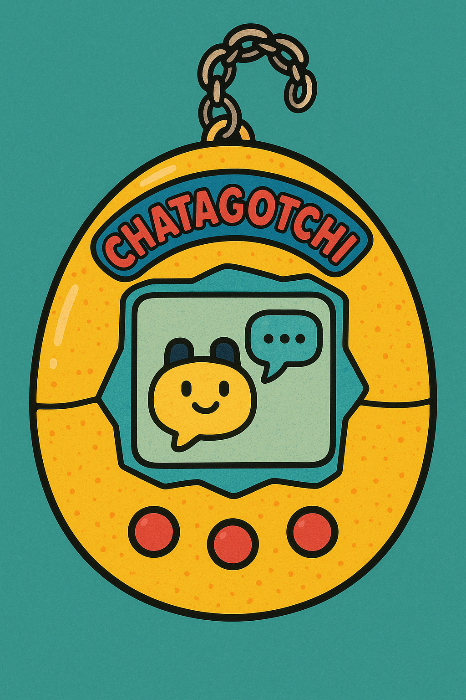

# Chatagotchi

[](LICENSE)

<table>
<tr>
<td></td>
<td>

A virtual pet game built with the Model Context Protocol (MCP) and OpenAI [Apps SDK](https://developers.openai.com/apps-sdk/). Raise pets, unlock achievements, and experience the nostalgia of digital companions—all inside ChatGPT.
Built with [Stytch](https://stytch.com), [Alpic](https://alpic.ai), and [Vercel](https://vercel/com). 
</td>
</tr>
</table>

## What is Chatagotchi?

Chatagotchi is an MCP server that brings interactive pet care to ChatGPT using the Apps SDK. Users can:

- 🐣 Start a new game and raise different kinds of pets (bird, cat, dog, lizard, or fish)
- 🍎 Feed their pet with different foods (apples, cookies, salad, pizza)
- 🎮 Play activities (video games, running, skiing)
- 🏆 Unlock 11 discovery achievements

## Architecture

Chatagotchi uses a three-layer architecture:

### MCP Server (`mcp_server_node/`)
Node.js/TypeScript server that exposes game tools via the Model Context Protocol. Built with:
- **Controllers** (`server.ts`) - MCP tool definitions for ChatGPT integration
- **Business Logic** (`game-service.ts`) - Game state management and message generation
- **Game Mechanics** (`game-logic.ts`) - Pure functions for pet actions, lifecycle, and achievements
- **Authentication** - Stytch Connected Apps for MCP authentication

### Website (`app/`)
A traditional React SPA responsible for marketing, user signup, and OAuth authorization.
- Hosted as standalone website on Vercel
- Functions as an OAuth Authorization Server

### Frontend Widgets (`widgets/`)
React components rendered inside ChatGPT via the Apps SDK:
- **Pet Widget** - Displays pet emoji, name, stats, lifecycle stage, and action buttons
- **Achievements Widget** - Gallery of locked/unlocked achievements with progress tracking
- **Utilities** - Shared hooks for accessing OpenAI global context and widget state

## Prerequisites

- Node.js 18+
- pnpm (recommended) or npm/yarn
- Stytch, Alpic, and Vercel accounts

## Deployment

Fork the repository in Github so you can connect your personal repository to Vercel and Alpic.

### Vercel Setup
1. Create a Vercel account at https://vercel.com/
2. Grant Vercel access to your forked repository, and deploy it
3. Remember your Vercel domain, which will look like `https://chatagotchi-$adjective.vercel.app`

### Stytch Setup

1. Create a Stytch account at https://stytch.com
2. Create a "Consumer" project and get your credentials from the Project Overview page
   - You'll need the `STYTCH_PROJECT_ID`, `STYTCH_SECRET`, `STYTCH_DOMAIN`, and `STYTCH_PUBLIC_TOKEN` for later
3. Navigate to Frontend SDK
   - Enable the Javascript SDK, and add your Vercel domain as an approved domain
4. Navigate to Connected Apps > Settings
   - Enable Dynamic Client Registration
   - Set `${VERCEL_DOMAIN}/oauth/authorize` as your project Authorization URL
5. Return to Vercel. Set your `STYTCH_PUBLIC_TOKEN` as a `VITE_STYTCH_PUBLIC_TOKEN` environment variable

### Alpic Setup

1. Create an Alpic account at https://alpic.ai
2. Grant Alpic access to your forked repository
3. Configure the following build settings:
   - Build Command: `pnpm run build:mcp` 
   - Output Directory: `./`
   - Start Command: `pnpm run --silent start:mcp`
4. Configure the following environment variables:
   - `STYTCH_PROJECT_ID` - your project ID from Stytch
   - `STYTCH_PROJECT_SECRET` - your project secret from Stytch
   - `STYTCH_DOMAIN` - your project domain from Stytch
   - `FRONTEND_DOMAIN` - your Vercel Domain
5. Redeploy the MCP server to ensure all settings have been applied

## Testing in ChatGPT

To add Chatagotchi to ChatGPT:

1. Enable [developer mode](https://platform.openai.com/docs/guides/developer-mode)
2. Add the ngrok URL to ChatGPT: **Settings > Connectors**
   - Use the MCP endpoint: `https://chatagotchi-xxxxx.alpic.live`

Once connected, try saying "Let's start a brand new chatagotchi game" to get started.

## Local Development

### Build the Frontend Widgets

Build widgets into static assets for deployment:

```bash
pnpm run build
```

This produces versioned `.html`, `.js`, and `.css` files in `assets/`. Each widget is self-contained with its own styles.

For local development with hot reload:

```bash
pnpm run dev
```

The dev server runs on `http://localhost:4444`

### Run the MCP Server

Start the MCP server:

```bash
pnpm start:mcp
```

## Contributing

Contributions are welcome! Open an issue or submit a PR to improve the game.

## License

This project is licensed under the MIT License. See [LICENSE](./LICENSE) for details.
